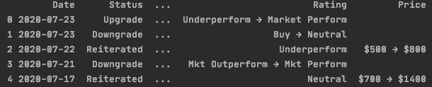
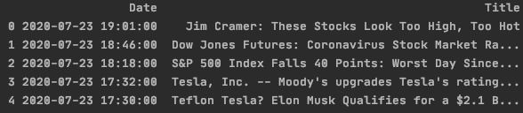
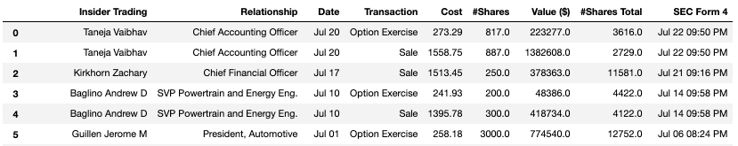
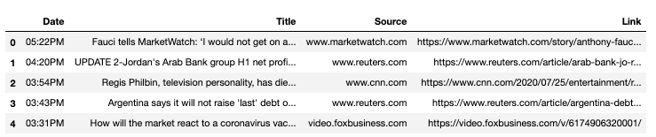
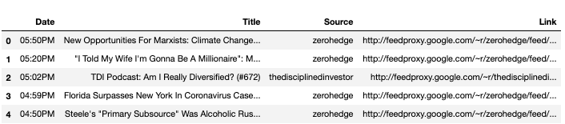
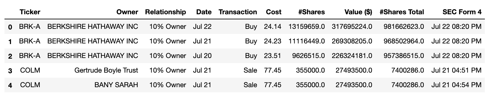
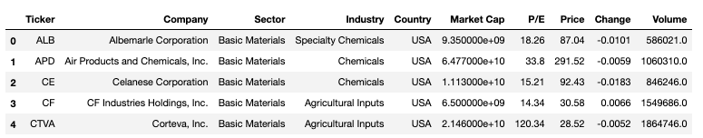

[](https://pepy.tech/project/finvizfinance)
[](https://www.codefactor.io/repository/github/lit26/finvizfinance/overview/master)
[](https://www.paypal.me/TIANNINGL/)

# finvizfinance

finvizfinance is a package which collects financial information from FinViz website. The package provides the information of the following:
* Stock charts, fundamental & technical information, insider information and stock news
* Forex charts and performance
* Crypto charts and performance

Screener and Group provide dataframes for comparing stocks according to different filters and trading signals.

Docs: https://finvizfinance.readthedocs.io/en/latest/

### Downloads

To download the latest version from GitHub:

```
$ git clone https://github.com/lit26/finvizfinance.git
```
Or install from PyPi:
```
$ pip install finvizfinance
```


### Quote

Getting information (fundament, description, outer rating, stock news, inside trader) of an individual stock.

```python
import pandas as pd
from finvizfinance.quote import finvizfinance

stock = finvizfinance('tsla')
```

#### Chart
```python
stock.TickerCharts()
```

#### Fundament
```python
stock_fundament = stock.TickerFundament()

# result
# stock_fundament = {'Company': 'Tesla, Inc.', 'Sector': 'Consumer Cyclical', 
# 'Industry': 'Auto Manufacturers', 'Country': 'USA', 'Index': '-', 'P/E': '849.57', 
# 'EPS (ttm)': '1.94', 'Insider Own': '0.10%', 'Shs Outstand': '186.00M', 
# 'Perf Week': '13.63%', 'Market Cap': '302.10B', 'Forward P/E': '106.17',
# ...}
```

#### Description
```python
stock_description = stock.TickerDescription()

# stock_description
# stock_description = 'Tesla, Inc. designs, develops, manufactures, ...'
```

#### Outer Ratings
```python
outer_ratings_df = stock.TickerOuterRatings()
``` 

#### Stock News
```python
news_df = stock.TickerNews()
```


#### Inside Trader
```python
inside_trader_df = stock.TickerInsideTrader()
```


### News

Getting recent financial news from finviz.

```python
from finvizfinance.news import finviznews

fnews = finviznews()
all_news = fnews.getNews()
```
Finviz News include 'news' and 'blogs'.
```python
all_news['news'].head()
```

```python
all_news['blogs'].head()
```


### Insider

Getting insider trading information.

```python
from finvizfinance.insider import Insider

finsider = Insider(option='top owner trade')
# option: latest, top week, top owner trade
# default: latest

insider_trader = finsider.getInsider()
```


### Screener (Overview, Valuation, Financial, Ownership, Performance, Technical)

Getting multiple tickers' information according to the filters.

#### Example: Overview

```python
from finvizfinance.screener.overview import Overview

foverview = Overview()
filters_dict = {'Index':'S&P 500','Sector':'Basic Materials'}
foverview.set_filter(filters_dict=filters_dict)
df = foverview.ScreenerView()
df.head()
```


### Screener (Ticker)

Getting list of tickers according to the filters.

### Credit
Developed by Tianning Li. Feel free to give comments or suggestions.
